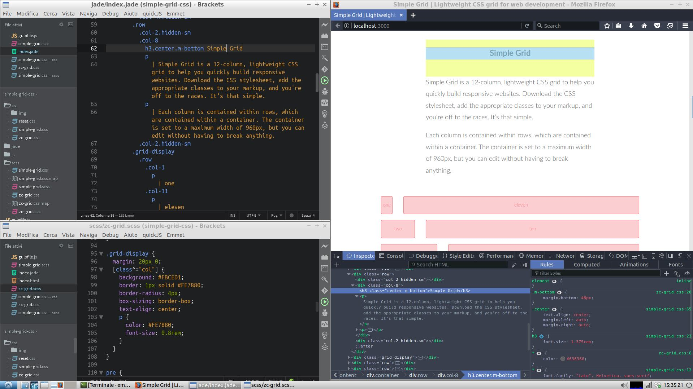

Sass & Jade Made Simple v1.0
=============================

Example code for using Gulp, Sass and Jade in web development.

# Installation

Clone this repo, or download it into a directory of your choice.

git clone https://github.com/promoweb/sass-jade-made-simple.git

Install the required Npm Packages locally from the command line (inside the sass-jade-made-simple directory) and start gulp:

$ npm install gulp gulp-sass gulp-uglify gulp-jade browser-sync

## Usage

Change directory from comman line inside the sass-jade-made-simple directory and start gulp

$ gulp

This will give you file watching, browser synchronisation, auto-rebuild, CSS injecting etc etc.

[Example on Linux Ubuntu 16.04.2 LTS](https://i.imgur.com/ptfWwjJ.jpg) 

### It uses Simple Grid | Lightweight CSS grid for web development

[Simple Grid](http://simplegrid.io/) | Lightweight CSS grid for web development
